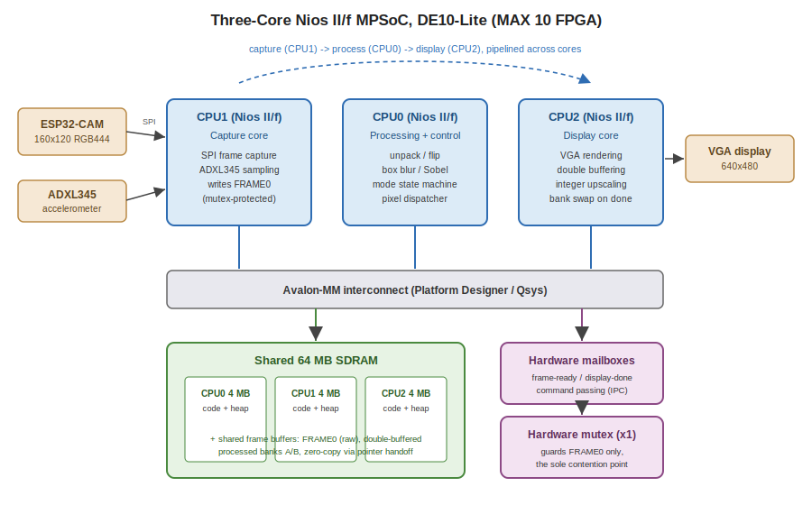
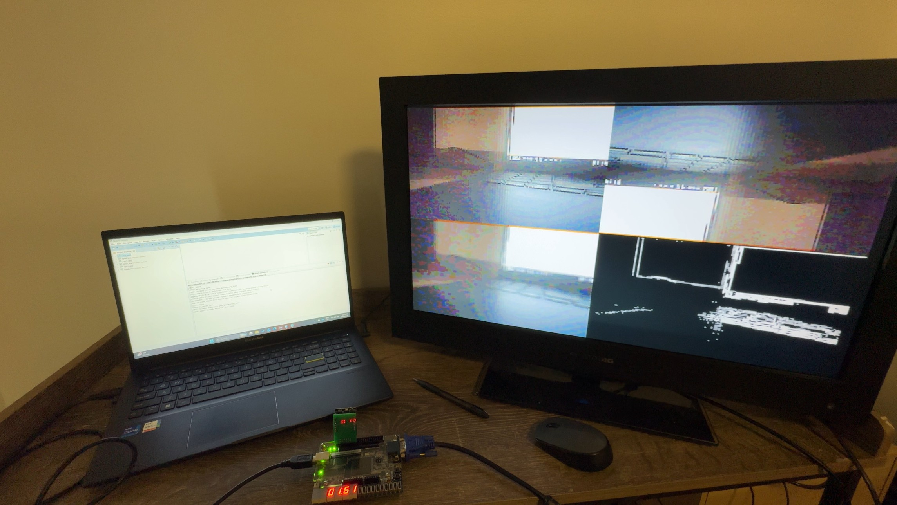
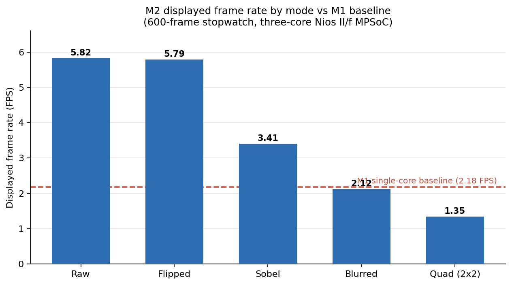

# Multi-Core Image Processing SoC on FPGA

**A three-core Nios II soft-processor system performing real-time camera capture, image processing, and VGA display on a DE10-Lite FPGA.**

Built for ECE3073 Computer Systems at Monash University (S1 2026) by Group D10. This repository documents the system architecture, design decisions, and measured performance. The assessable source code is kept private in line with Monash academic integrity policy.

---

## What it does

An ESP32-CAM streams 160x120 colour frames over SPI into the FPGA, where a three-core multiprocessor system-on-chip processes and displays them on a VGA monitor in real time. Five display modes are supported: raw passthrough, horizontal flip, 3x3 box blur, Sobel edge detection, and a 2x2 quad view showing all four simultaneously. Mode selection is driven by an ADXL345 accelerometer, so tilting the board switches the view.

## Architecture

The system is built in Intel Platform Designer (Qsys) around three Nios II/f cores, each dedicated to one pipeline stage:

| Core | Role | Responsibilities |
|------|------|------------------|
| CPU1 | Capture | SPI frame capture from ESP32-CAM, ADXL345 accelerometer sampling |
| CPU0 | Processing + control | Unpack, flip, blur, Sobel; mode state machine; pixel dispatcher |
| CPU2 | Display | VGA rendering with double buffering and integer upscaling |

Because the three stages run on separate cores, capture, processing, and display of consecutive frames overlap in time instead of serialising on one processor. That pipelining is where most of the speedup comes from.

### Memory architecture

All three cores share a 64 MB SDRAM. Each core owns a private 4 MB partition for its code and heap, which keeps instruction fetch and stack traffic from interfering across cores. The frame buffers live in a shared region:

- **FRAME0**: the raw capture buffer written by CPU1 and read by CPU0
- **Processed banks A/B**: a double-buffered pair. CPU0 writes one bank while CPU2 renders the other, and the banks swap when the display signals completion.

Frames are passed **zero-copy**. No core ever memcpy's a frame to hand it to the next stage; ownership of a buffer is transferred by message, and the receiving core reads it in place. At 28,800 bytes per frame, avoiding those copies matters.

### Inter-processor communication and synchronisation

IPC uses **hardware mailbox** peripherals for command and status passing (frame-ready, display-done, mode changes) and a **single hardware mutex**.

A deliberate design decision: the mutex guards only FRAME0, because that is the only buffer where two cores (CPU1 writing, CPU0 reading) can genuinely contend at the same time. The processed banks need no lock at all, since the mailbox handshake makes buffer ownership unambiguous: CPU0 and CPU2 are never touching the same bank simultaneously by construction. Reducing synchronisation to the one unavoidable contention point keeps lock overhead off the hot path while still ruling out unsafe shared-memory access.

### Two-regime pipeline behaviour

Profiling revealed the pipeline operates in two distinct regimes:

- **Light modes (Raw, Flipped)**: processing is short, so SPI capture is not fully hidden and residual capture time stays exposed on the critical path. This is why Flipped runs at essentially the same rate as Raw despite doing extra work; the flip simply consumes slack that was previously idle capture-wait.
- **Heavy modes (Blurred, Sobel, Quad)**: processing exceeds capture time, so double buffering fully overlaps capture behind computation and the frame period reduces to processing plus render.

## Performance

Measured with a 600-displayed-frame wall-clock stopwatch (the honest method: because the display is double-buffered, summing CPU-side stage times overstates the real displayed rate). Each mode was sampled 5 to 6 times with under 1% variance, and cross-validated against per-stage timestamps averaged over 60 frames.

| Mode | Displayed FPS | Frame period (ms) |
|------|---------------|-------------------|
| Raw | 5.82 | 172.0 |
| Flipped | 5.79 | 172.8 |
| Sobel | 3.41 | 293.5 |
| Blurred | 2.12 | 472.5 |
| Quad (2x2) | 1.35 | 741.1 |

**Headline result: 2.18 FPS to 5.82 FPS for equivalent capture-and-display work, a 167% improvement over the single-core Milestone 1 baseline**, against a target of 50%. The M2 system is simultaneously faster and far more capable: M1 displayed unprocessed greyscale, while M2 adds 12-bit colour, flip, blur, Sobel, and the quad view.

Per-stage CPU0 timing (microseconds, averaged over 60 frames) shows blur dominating the heavy-mode budget, which confirmed the convolution kernels were the right optimisation target:

| Mode | Unpack | Flip | Blur | Sobel | Render |
|------|--------|------|------|-------|--------|
| Raw | 25,577 | - | - | - | 82,252 |
| Flipped | 25,570 | 43,135 | - | - | 82,239 |
| Blurred | 25,620 | - | 365,800 | - | 82,313 |
| Sobel | 25,622 | - | - | 185,545 | 82,572 |
| Quad | 26,000 | 42,871 | 365,417 | 184,356 | 124,353 |

## Key optimisations beyond parallelism

**RGB444 packed pixel format.** Two 12-bit colour pixels pack into three bytes at 100% byte utilisation. RGB565 would waste part of every transfer across the 24-bit boundary, and RGB888 would cost 33% more SPI bandwidth for negligible perceptual gain on a small VGA panel. Result: full colour with no SPI bandwidth penalty over the original greyscale baseline.

**Process only what is displayed.** A dispatcher on CPU0 skips any pipeline stage whose output the current mode does not show. Without it, every frame would unconditionally run all four processing variants, adding roughly 600 ms of redundant convolution per frame and dragging Raw mode down to about 1.4 FPS. That is a 4x slowdown avoided by a small switch statement, made cheap because the active mode was already tracked in the control state machine.

**Convolution kernel optimisations.** Six changes to the blur and Sobel kernels, each preserving mathematically identical output:

1. Replacing the box-blur divide-by-9 with a fixed-point multiply and shift, eliminating the multi-cycle Nios II software divide from the inner loop
2. Bit-shifts in place of the Sobel kernel's power-of-two multiplies
3. Row base addresses hoisted out of the inner column loop
4. Skipping the Sobel centre pixel entirely (its kernel coefficient is zero)
5. L1 gradient norm in place of the square-root L2 norm
6. Fuse the Sobel stages into a single pass, where Gx, Gy, gradient magnitude, and thresholding are computed together

## Verification approach

Frame rate claims were validated two independent ways: per-stage timestamps on CPU0 (averaged over 60 frames) and a true end-to-end stopwatch over 600 displayed frames. The two methods cross-check: measured displayed period equals processing plus render time, plus exposed capture in the light modes. Trusting a single CPU-side measurement would have overstated performance, since the double buffer decouples the processing loop from the visible refresh.

## Tools

- Intel Quartus Prime + Platform Designer (Qsys) for hardware system design and synthesis
- Nios II Software Build Tools for Eclipse for the per-core C applications
- DE10-Lite (Intel MAX 10) development board
- ESP32-CAM camera module, ADXL345 accelerometer

## FPGA resource utilisation

From the Quartus Fitter report (MAX 10, 10M50DAF484C7G):

| Resource | Used | Available | Utilisation |
|----------|------|-----------|-------------|
| Logic elements | 13,519 | 49,760 | 27% |
| Registers | 8,253 | - | - |
| Memory bits | 1,117,440 | 1,677,312 | 67% |
| Embedded 9-bit multipliers | 18 | 288 | 6% |
| PLLs | 2 | 4 | 50% |
| Pins | 166 | 360 | 46% |

Logic is light at 27% even with three full Nios II/f cores, while on-chip memory is the constrained resource at 67%, driven by per-core caches and tightly coupled memories. That headroom split is why frame buffers live in external SDRAM rather than block RAM.

---